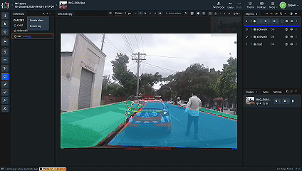
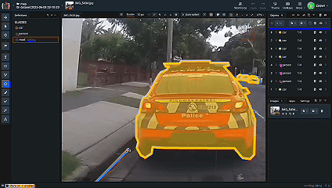
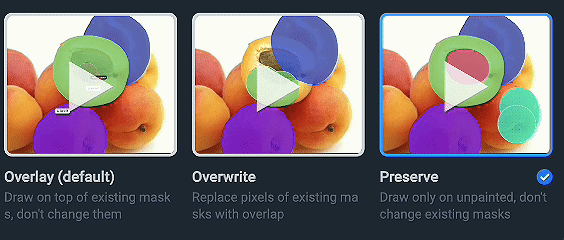
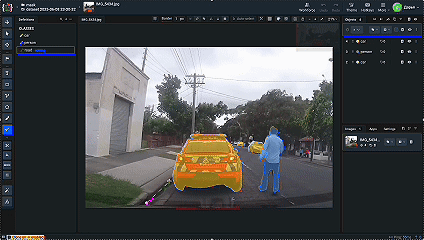

# Manual Annotation Methods for Self-Driving vehicles

Image annotation is a key part of training computer vision models. For self-driving vehicles, it’s especially important because of the model needs to not only see objects, but also understand _what_ they are and _where_ they are.

In this tutorial, I’ll show you three simple and practical ways to manually annotate images for **instance segmentation**. I used [Supervisely](https://supervisely.com/) and a basic dashcam photo to keep things clear and easy to follow.

----------

## 1. Overlay Annotation _(a.k.a. Layering)_

The first method is layering - objects are drawn one by one, even if they overlap.

I use the **Polygon Tool** here, but you are free to choose another tool.

### How it works

-   Draw each shape separately
    
-   Let them overlap if needed
 
-   Use the layer panel to set object order (road under car, etc.)
    

*GIF: Image of annotating manually in Supervisely using Overlap method*

### When to use it

-   Fast annotations
    
-   Scenes where things are stacked or occluded (like trees, signs, people)
    

### Pros

-   Quick and flexible
    
-   Easy to use
    

### Cons

-   Overlaps might need cleanup
    
-   Not always best for training unless post-processed
   

----------

## 2. Snapping Annotation _(a.k.a. Puzzle logic)_

This time, shapes should fit together like puzzle pieces - no overlaps. A key challenge in using Snapping is needed to connect the boundaries of each object in an image. To ease this process, the Supervisely team introduced a **Polygon Snapping tool for Objects Linking**, significantly simplifying the task. It lets points "stick" to edges of existing shapes. 

### How it works

-   Annotate one object (e.g. a car)
    
-   When drawing the next (e.g. road), snap the polygon to the car’s edge
    
-   This creates perfect alignment without overlap

*GIF: Image of using Polygon Snapping tool for Objects Linking*

### When to use it
- In simple scenes (only a few neighboring objects)

-   If you want clean, non-overlapping annotations
    
-   Structured scenes: streets, sidewalks, traffic signs
    

### Pros

-   Very neat borders
    
-   Good for post-processing
    

### Cons

-   Slower
    
-   Requires careful clicking
    

----------

## 3. Splitting _(Pixel-perfect mode)_

The third method is **splitting**, and here every pixel belongs to _only one_ class.

I use the **Mask Pen Tool**, and draw either polygons or free shapes.

### How it works

-   Create masks for each object, avoid overlaps
    
-   Masks have drawing modes:
    
    -   Overlay
        
    -   Overwrite any pixel
        
    -   Preserve (paint only empty areas)
 

*GIF: Image of mask modes*

 By the way, for spliting method you should choose overwrite and preserve
        

These options control how new shapes interact with the existing ones.

*GIF: Image of using spliting method*

### When to use it

-   You need precise annotations (trees, shadows, tricky shapes)
    
-   You’re making ground-truth data for evaluation
    

### Pros

-   Highest accuracy
    
-   Great for detailed shapes
    

### Cons

-   Time-consuming
    
-   Bigger file sizes
    

----------

## Comparison Table

| Method   | Logic         | Accuracy | Speed   | Best For                          |
|----------|---------------|-------------|-----------|-----------------------------------|
| Overlay  | Layering      | medium         | fast   | Occlusion, drafts, trees          |
| Snapping | Puzzle        | high        | moderate  | Roads, cars, clear shapes         |
| Mask     | Pixel mapping | pixel-perfecr      | slow  | Evaluation, fine segmentation     |

----------

## Wrap-up

Each of these methods works good, depends on your task. Sometimes you want speed, other times you need precision.

If you’re working on self-driving data, mixing methods can save you time and boost quality.

**Watch the full video tutorial here**: [Manual Annotation Methods for Self-Driving vehicles](https://youtu.be/Kwc2B_l6B-I)
